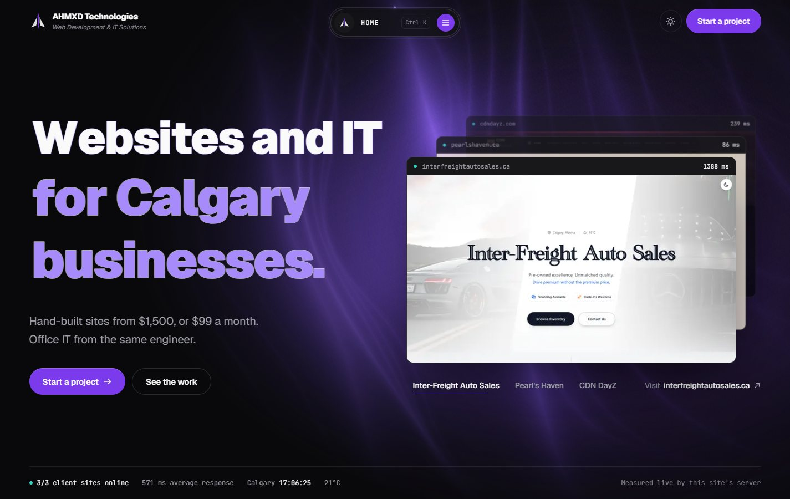
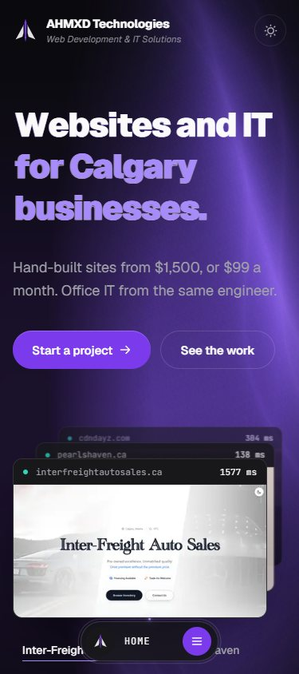

<div align="center">


# AHMXD Technologies

**Web development and IT solutions for Calgary businesses.**

[ahmxdtechnologies.ca](https://ahmxdtechnologies.ca) &nbsp;·&nbsp; [Portfolio](https://portfolio.ahmxd.net) &nbsp;·&nbsp; [LinkedIn](https://www.linkedin.com/in/salman-ahmad-6788811b6/) &nbsp;·&nbsp; [Email](mailto:s.ahmad0147@gmail.com)

[](https://ahmxdtechnologies.ca)
[](https://ahmxdtechnologies.ca)
[](LICENSE)


<br />



</div>

> [!IMPORTANT]
> **This is the private source code of my business website, not a template or an open-source project.**
> It is not packaged for anyone else to install, run or reuse, and no licence is granted to do so. All rights are reserved. See [Ownership and licence](#ownership-and-licence).

---

## Contents

- [About this project](#about-this-project)
- [What the site does](#what-the-site-does)
- [Built with](#built-with)
- [How it is built](#how-it-is-built)
- [Engineering standards](#engineering-standards)
- [Privacy and security](#privacy-and-security)
- [Hosting and releases](#hosting-and-releases)
- [Ownership and licence](#ownership-and-licence)
- [Contact](#contact)

---

## About this project

I'm **Salman Ahmad**, a software developer in Calgary, Alberta. I run **AHMXD Technologies**, where I design, build and look after websites, web apps and office IT for local businesses.

This repository is the website I use to present that business to clients. It is the client-facing companion to my [portfolio](https://portfolio.ahmxd.net), which covers my engineering background, and it shares that site's visual identity.

I built it to do three things well:

1. **Show real work, live.** Visitors see the sites I have built for clients, with response times measured in real time, instead of a gallery of static mockups.
2. **Be upfront about price and ownership.** Plans and prices are published, and the site spells out who owns what before anyone has to ask.
3. **Earn trust quickly.** The security and continuity promises, the legal pages and the contact flow are written in plain language, so a business owner can decide without a sales call.

<div align="center">

</div>

---

## What the site does

| Area | What visitors get |
|---|---|
| **Live proof** | The hero stacks my client sites like open browser windows. Each one shows its current response time, and a live bar reports how many client sites are online, their average response, and the time and temperature in Calgary. The readings come from this site's own server. |
| **Services** | Websites, web apps, office IT and automation, with published starting prices. |
| **Pricing** | Three plans with a switch between paying upfront and paying monthly, the process from scope to support, and the payment terms, ownership rules and other prices laid out in full. |
| **Trust** | Who builds the work, and the promises that protect a client: two-factor sign-in, encryption, backups, a breach plan, the domain in the client's name, and what happens if I am ever unavailable. |
| **Questions** | Straight answers on cost, ownership, timelines and support. |
| **Contact** | A brief builder: visitors pick what they need and how they would like to pay, and their own email app opens with the message written. The site itself stores and sends nothing. |
| **Legal** | A Terms of Service covering intellectual property, licensing, payments and hosting, and a Privacy Policy written to Alberta's *Personal Information Protection Act*. |

Other details:

- **Light and dark themes**, with dark as the default and the visitor's choice remembered on their device.
- **Command palette navigation**: a floating menu that tracks the current section and opens with <kbd>Ctrl</kbd> / <kbd>⌘</kbd> + <kbd>K</kbd>.
- **A readiness-driven loading screen** that waits for real signals (fonts, the first screenshot, the WebGL background) rather than a timer, and can be skipped with any key or click.

---

## Built with

| Layer | Technology |
|---|---|
| Framework | [Next.js 16](https://nextjs.org) (App Router, Turbopack) and [React 19](https://react.dev) |
| Language | [TypeScript 5](https://www.typescriptlang.org) |
| Styling | [Tailwind CSS 4](https://tailwindcss.com) with design tokens as CSS variables |
| Motion | [Motion](https://motion.dev) for interface animation, [GSAP](https://gsap.com) ScrollTrigger for drawn headings, [OGL](https://github.com/oframe/ogl) for the WebGL background |
| Components | Adapted from [React Bits](https://reactbits.dev) and [Aceternity UI](https://ui.aceternity.com), rebuilt to the brand |
| Icons and type | [Phosphor Icons](https://phosphoricons.com), [Geist](https://vercel.com/font) and JetBrains Mono |
| Live data | Next.js route handlers for client-site status and Calgary weather ([Open-Meteo](https://open-meteo.com)), cached at the edge |
| Hosting | [Vercel](https://vercel.com) |

---

## How it is built

```text
src/
├── app/                 Routes, metadata, sitemap, robots, social card, API route handlers
│   ├── (legal)/         Terms of Service and Privacy Policy
│   └── api/             /api/status (client sites) and /api/weather (Calgary)
├── components/          Page sections, navigation, loader, legal layout, shared building blocks
│   └── reactbits/       Adapted React Bits components (drawn text, WebGL background, text scramble)
└── lib/
    └── site.ts          Single source of truth for copy, prices, terms, FAQ and projects
```

A few decisions that shape the codebase:

- **One source of truth for content.** Every price, term, FAQ answer and project lives in `src/lib/site.ts`. The hero, pricing, FAQ, legal pages and structured data all read from it, so they can never disagree.
- **Live data without extra load.** The status and weather endpoints are cached at the edge (five and ten minutes), and the page shares one request per endpoint however many components show the data.
- **Server and client split.** Static content and the legal pages render on the server; interactive sections (pricing, navigation, the contact form) are client components.
- **Honest motion.** Animations explain state changes (a price switching, a site coming forward) rather than decorate, and all of them respect the visitor's reduced-motion setting.

---

## Engineering standards

- **Accessibility:** semantic landmarks and headings, full keyboard support (menus, tabs, radio groups, disclosures), visible focus states, text alternatives for images, and reduced-motion support throughout.
- **Quality gates:** strict TypeScript and ESLint must pass, and every release is checked with a production build before it ships.
- **Verification:** changes are checked in real browsers at desktop and phone sizes, in both themes, before they go live.
- **Search and sharing:** canonical URLs, a sitemap, Open Graph images and `ProfessionalService` structured data are generated from the same content source.

---

## Privacy and security

- **No tracking:** the site uses no analytics, advertising or tracking cookies, so there is no cookie banner. The only thing stored in the browser is the visitor's light or dark theme choice.
- **Nothing collected by the form:** the contact form builds an email in the visitor's own mail app and sends nothing to a server.
- **Secrets stay out of the repository:** environment files and deployment settings are excluded from version control.
- **Encrypted everywhere:** every page is served over HTTPS.

The full commitments are in the site's [Privacy Policy](https://ahmxdtechnologies.ca/privacy) and [Terms of Service](https://ahmxdtechnologies.ca/terms).

---

## Hosting and releases

- **Production:** [ahmxdtechnologies.ca](https://ahmxdtechnologies.ca), hosted on Vercel. `www.ahmxdtechnologies.ca` redirects to it.
- **Releases:** changes are developed on a branch and reviewed on a private preview deployment. Merging into `main` publishes them to production automatically.
- **Maintenance:** the site is maintained by me alone. It is not accepting outside contributions, issues or pull requests.

---

## Ownership and licence

**© 2026 Salman Ahmad, operating as AHMXD Technologies. All rights reserved.**

This repository, including its source code, design, copy, images and branding, is proprietary. No licence is granted to copy, modify, distribute, host, sublicense or create derivative works from any part of it without my prior written permission. Viewing the code does not grant any right to use it.

Screenshots of client websites show work I built for those clients; the sites, their content and their brands belong to their respective owners. Open-source dependencies are used under their own licences, and their authors retain their rights.

See [LICENSE](LICENSE) for the full notice.

---

## Contact

If you are a business looking for a website, a web app or help with your office IT, the quickest way to reach me is through the site.

- **Website:** [ahmxdtechnologies.ca](https://ahmxdtechnologies.ca)
- **Email:** [s.ahmad0147@gmail.com](mailto:s.ahmad0147@gmail.com)
- **Portfolio:** [portfolio.ahmxd.net](https://portfolio.ahmxd.net)
- **LinkedIn:** [Salman Ahmad](https://www.linkedin.com/in/salman-ahmad-6788811b6/)

<div align="center">
<br />
<sub>Designed, built and maintained in Calgary, Alberta by Salman Ahmad.</sub>
</div>
